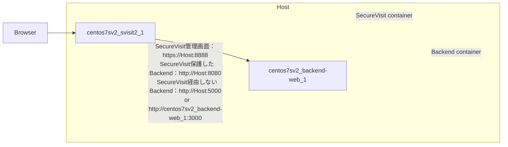

# centos7sv2 The SecureVisit Playground

A docker playground for SecureVisit 2.0.0.9 RHEL.
It contains
- a SecureVisit 2.0.0.9 RHEL running on a CentOS7.9, port 8888 for admin portal.
- a dumy backend web application server, port 5000 for HTTP access.
- ~~a PostgreSQL server for the backend server, service on port 5432.~~

## Dependencies
- Docker Desktop for Windows (>4.4.2)
- (optional) pgAdmin

## Build and start this playground
### Bring up servers
Place SecureVisit installer rpm `svisitc-2.0.0-9.el7.x86_64.rpm` in the `svisit2` sub-folder, and run following command in terminal:
```bash
docker-compose up --build
```
### Finish SecureVisit initialization by following steps:  
- SecureVisit installation contains some interactive steps, so open another terminal and attach to the svisit2 container like following. 
```bash
docker exec -it centos7sv2_svisit2_1 bash
```
- Run initialize scripts in the svisit2 container.
```bash
/svisit/sbin/sv_init
service svisitd start
exit
```
- Install SecureVisit admin client certificate `svisit2/admin.p12` to your browser. Usually uses cert import function in your browser.
- Access `https://<docker host>:8888/` for SecureVisit admin portal and set Port to `8080` in **Server Setting** tab and change **default** mapping's target URL to `http://centos7sv2_backend-web_1:3000`.

## Have fun
- Backend through SecureVisit: `http://<docker host>:8080/`
- SecureVisit admin portal: `https://<docker host>:8888/`
- Backend web application server: `http://<docker host>:5000/` 
- SecureVisit mapping setting to backend server: Port `8080`, `default` map to `http://centos7sv2_backend-web_1:3000/`
- Enable debug log of SecureVisit:
```bash
docker exec -it centos7sv2_svisit2_1 bash
echo "local5.debug;local5.err;local5.alert;local5.emerg;local5.info  /usr/local/svisit/log/sv.debug.log" >> /etc/rsyslog.conf
systemctl restart rsyslog
``` 
- SecureVisit fresh nginx logs: `docker exec -it centos7sv2_svisit2_1 bash -c "tail -f /svisit/logs/*.log"`
- SecureVisit fresh svisitd logs: `docker exec -it centos7sv2_svisit2_1 bash -c "tail -f /svisit/log/*.log"`
- Monitor SecureVisit internal redis actions:
```bash
docker exec -it centos7sv2_svisit2_1 bash
yum install telnet
telnet localhost 6379
AUTH <redis password> #ask developer
MONITOR
```
- Use pgAdmin to access PostgreSQL server. User/Password are both `postgres`, port `5432`.

## Reference
- CentOS7 docker container seems not support cgroupv2 well, which will cause rsyslog and cron services do not start. Read following for more info.
[https://qiita.com/ryysud/items/e6bfd61a121d6f922288]
- There are some notice to use **systemd** in container:
[https://systemd.io/CONTAINER_INTERFACE/]
[https://developers.redhat.com/blog/2016/09/13/running-systemd-in-a-non-privileged-container#]
- Failed to get D-Bus connection:Operation not permitted
[https://labor.ewigleere.net/2021/02/11/docker_commit_and_test_systemctl_start_httpd/]
